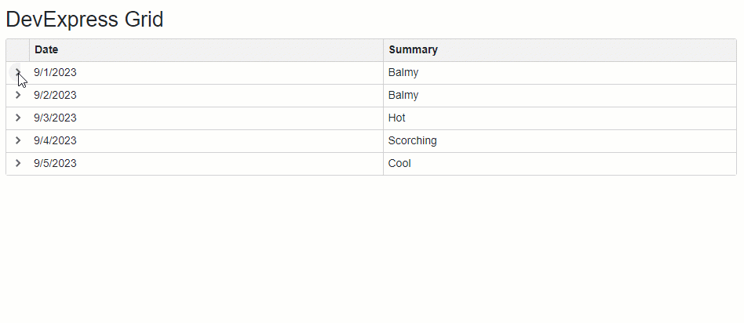

<!-- default badges list -->
[](https://supportcenter.devexpress.com/ticket/details/T1187305)
[](https://docs.devexpress.com/GeneralInformation/403183)
<!-- default badges end -->
# Grid for Blazor - Master-Detail with partial loading

The DevExpress Blazor Grid component allows you to create hierarchical layouts of any complexity and depth. 

This example uses a nested component to visualize a master-detail relationship between two data tables. It also shows how to integrate a Loading Panel into the detail area. The panel appears while the nested component retrieves records from a database and renders them.



Follow the steps below to set up a master-detail relationship:

1. Add a master grid to your application. Specify the grid's data source and columns. In this example, the **Index.razor** file implements the master grid.
2. Add a [DetailRowTemplate](https://docs.devexpress.com/Blazor/DevExpress.Blazor.DxGrid.DetailRowTemplate) to the grid's markup to create a detail view.
3. Create a separate component that implements a detail view (**DetailContent.razor**). This view may contain any custom content. In this example, another grid displays detail information. The **GetItemsByDateAsync** method imitates a time-consuming operation that retrieves data.
4. Place a Loading Panel to the detail view markup. The following snippet keeps the Loading Panel visible until the detail control obtains its data:

    ```Razor
    <DxLoadingPanel Visible=@(Records == null) />
    ```
    
5. Add the detail view to the **DetailRowTemplate**. Bind this view to a detail data source (use the template's context object as a filter criteria).

## Files to Review

- [Index.razor](./CS/GridPartialLoading/Pages/Index.razor)
- [DetailContent.razor](./CS/GridPartialLoading/Pages/DetailContent.razor)

## Documentation

- [DetailRowTemplate](https://docs.devexpress.com/Blazor/DevExpress.Blazor.DxGrid.DetailRowTemplate)
- [DxLoadingPanel](https://docs.devexpress.com/Blazor/DevExpress.Blazor.DxLoadingPanel)

## More Examples

- [Grid for Blazor - How to add a nested Grid to create a master-detail layout](https://github.com/DevExpress-Examples/blazor-dxgrid-master-detail-grid)
- [Grid for Blazor - Save and load layout information](https://github.com/DevExpress-Examples/blazor-DxGrid-save-restore-layout)
